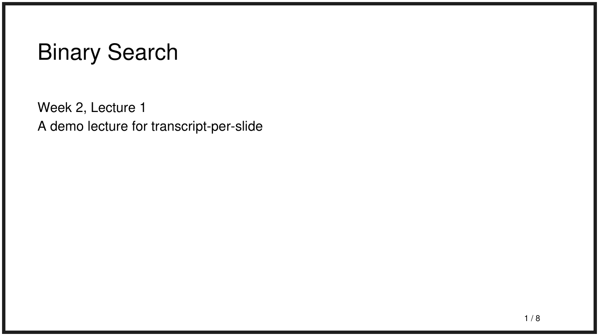
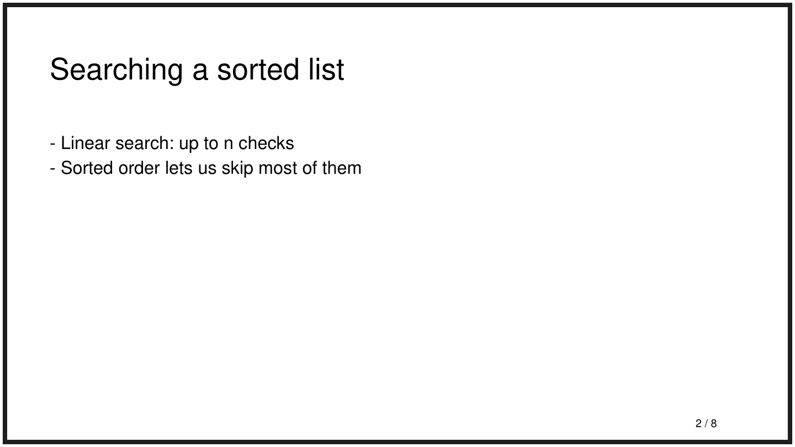
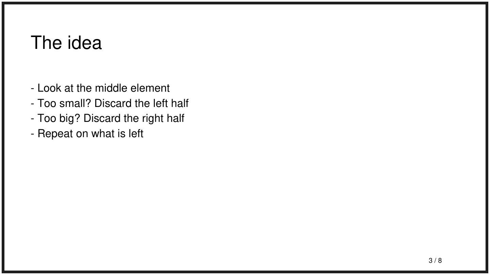
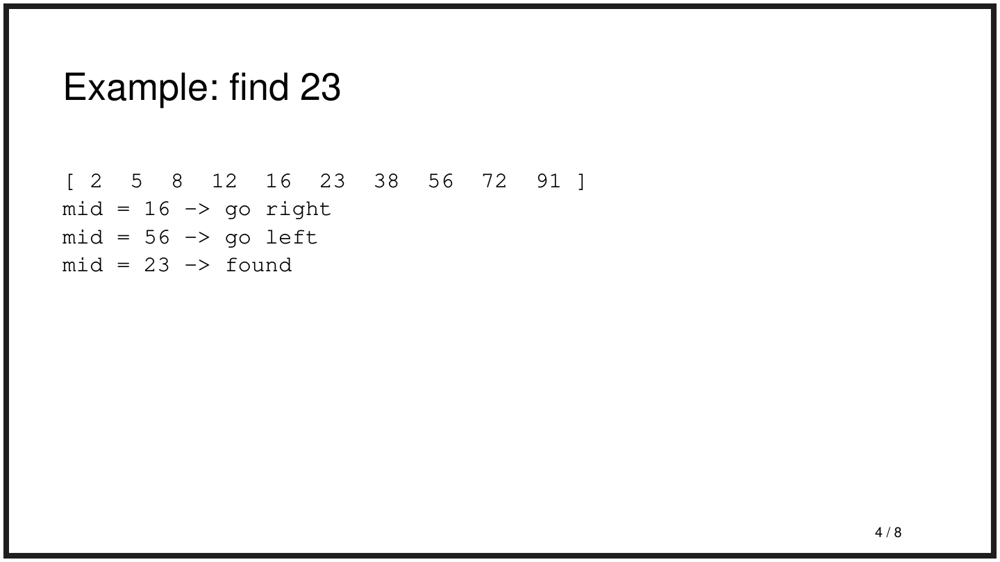
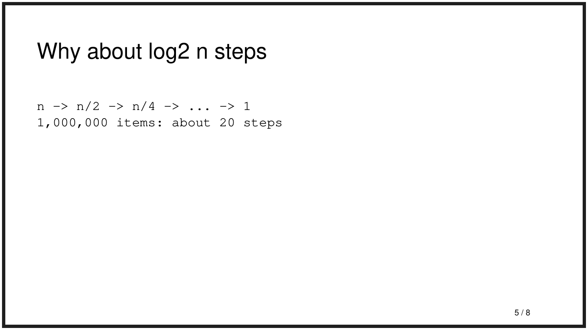
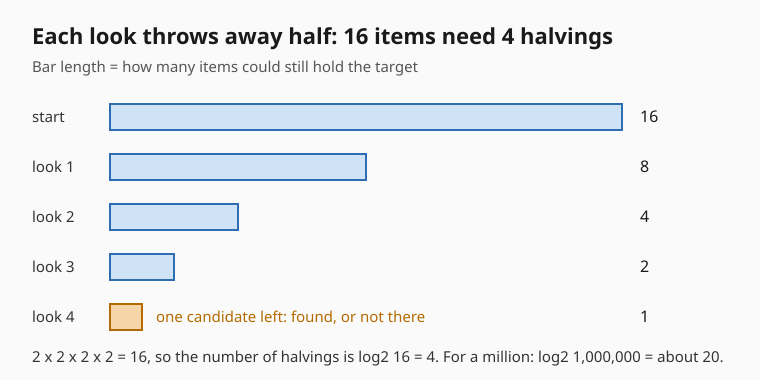
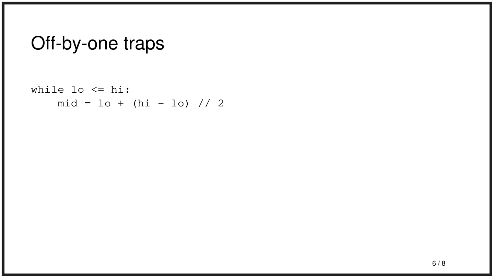
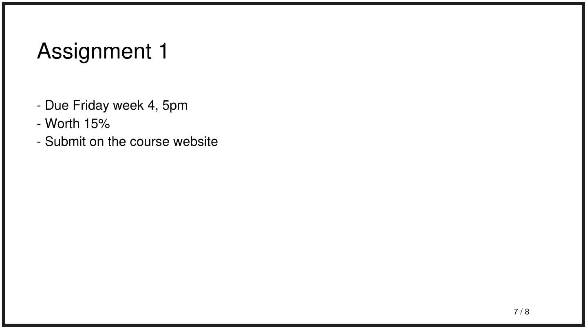
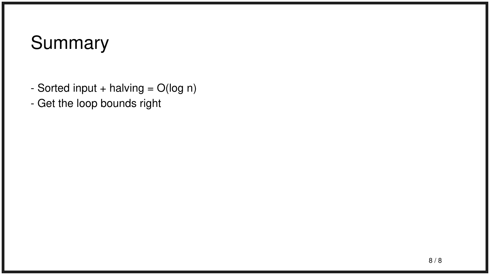

# w2-binary-search

Slides: `slides/binary-search.pdf`  
Transcript: `transcripts/binary-search-recording.vtt`

**★ Notices (marks, exams, deadlines, assignments, access)**

- ★ [deadline] 7. Assignment 1

## Why sorted order helps

### 1. Binary Search

Today is binary search. You have probably seen it before, but we are going to do it properly.

<!-- note:1 -->
<!-- /note:1 -->

### 2. Searching a sorted list

If a list is not sorted, you have no choice: you check every element, up to **n** checks.

If it is sorted, the order itself tells you where the target **cannot** be, so you get to skip most of the list.

<!-- note:2 -->
<!-- /note:2 -->

---

## How binary search works

### 3. The idea

The idea is simple. Look at the middle element:

- **Too small**: everything to its left is too small as well. Throw that half away.
- **Too big**: throw away the right half.

Then do the same thing on whatever is left.

<!-- note:3 -->
<!-- /note:3 -->

### 4. Example: find 23

Let's find 23.

1. The middle is 16: too small, so go right.
2. Now the middle is 56: too big, so go left.
3. The middle of what is left is 23. Found.

Three looks instead of the six a linear scan would need.

<!-- note:4 -->
<!-- /note:4 -->

### 5. Why about log2 n steps

Why `log n`? Every step **halves** what is left: n, then n/2, then n/4, until one element remains.

How many halvings take you from a million down to one? About **20**. Twenty looks for a million items: that is the whole point.

<!-- note:5 -->
#### What log2 n counts: halvings, not items

`log2 n` answers one question: **how many times can you halve n before one item is left?** Each look at the middle is one halving, so that is also the number of looks.

- 16 → 8 → 4 → 2 → 1 is 4 halvings, and 2 × 2 × 2 × 2 = 16, so `log2 16 = 4`.
- 2^20 is about a million, so a million items need about 20 looks.

##### Why doubling the list adds only one look

Twice as many items means one extra halving to get back to where you were. That is what "logarithmic" means in practice: 1,000 items need about 10 looks, 1,000,000 about 20, 1,000,000,000 about 30.
<!-- /note:5 -->

### 6. Off-by-one traps

This is where everyone gets it wrong.

- The loop condition is `lo <= hi`, not `lo < hi`, or you miss the last element.
- Write the midpoint as `mid = lo + (hi - lo) // 2`. In some languages `lo + hi` can overflow, and that bug sat in real libraries for years.

<!-- note:6 -->
<!-- /note:6 -->

---

## Admin

### ★ [deadline] 7. Assignment 1

Before I forget, Assignment 1:

- Due **Friday of week 4, 5 pm**.
- Worth **15%**.
- Submit it on the **course website**, not by email.

<!-- note:7 -->
<!-- /note:7 -->

---

## Wrap-up

### 8. Summary

> **No recording** (the recording ended earlier).
>
> Two things to take away. Sorted input plus halving the range each step gives you `O(log n)`. And most binary search bugs are in the loop bounds, so get `lo <= hi` and the midpoint right.

<!-- note:8 -->
<!-- /note:8 -->
